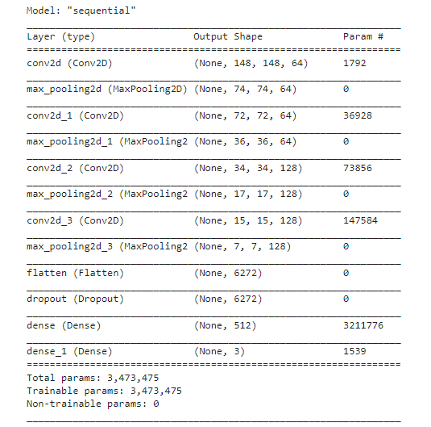
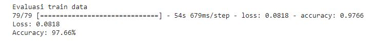
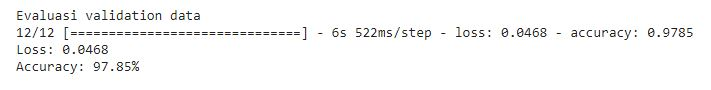
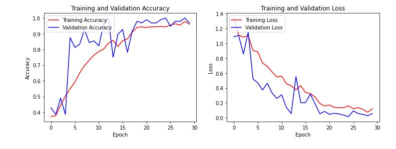
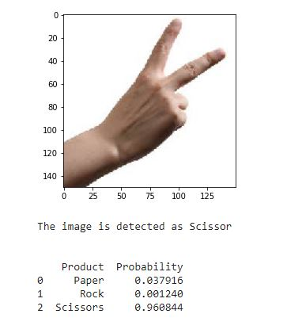

<h1 align="center"> Rock-Paper-Scissors Classifier </h1>

    

## Overview
This project is an image classification application using Tensorflow and Keras. This dataset contains images of hand gestures from the game Rock-Paper-Scissors. In this project I created a machine learning model using the Convolution Neural Network from Tensorflow to classify Rock-Paper-Scissors data.

## Dataset
The data set for this project was obtained from GoogleAPIs, in [this](https://storage.googleapis.com/laurencemoroney-blog.appspot.com/rps.zip) and [this](https://storage.googleapis.com/laurencemoroney-blog.appspot.com/rps-test-set.zip). You can also get it from [Kaggle](https://www.kaggle.com/sanikamal/rock-paper-scissors-dataset).
Rock Paper Scissors contains images from a variety of different hands, from different races, ages and genders, posed into Rock / Paper or Scissors and labelled as such. These images have all been generated using CGI techniques as an experiment in determining if a CGI-based dataset can be used for classification against real images. Rock Paper Scissors is a dataset containing 2,892 images of diverse hands in Rock/Paper/Scissors poses. There are 2520 images in the training set; and 372 images in the test set.

Note that all of this data is posed against a white background.
Each image is 300×300 pixels in 24-bit color

## Work Steps
<ol>
  <li>Import libraries</li>
  <li>Download and extract file</li>
  <li>Storing training and validation data sets into variables</li>
  <li>Data pre-processing using image augmentation</li>
  <li>Prepare train data</li>
  <li>Building a model architecture with CNN</li>
  <li>Create Callbacks</li>
  <li>Model Evaluate</li>
  <li>Plotting accuracy and loss</li>
  <li>Predict image</li>
</ol>  

## Model SUmmary 

## Model Evaluate
We achieved 97,66% accuracy on training set and 97,85% accuracy on validation set.

## Visualize Accuracy and Loss 

## Predict Model

    

